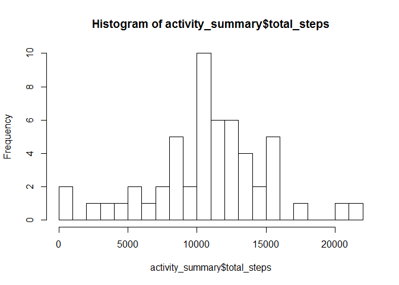
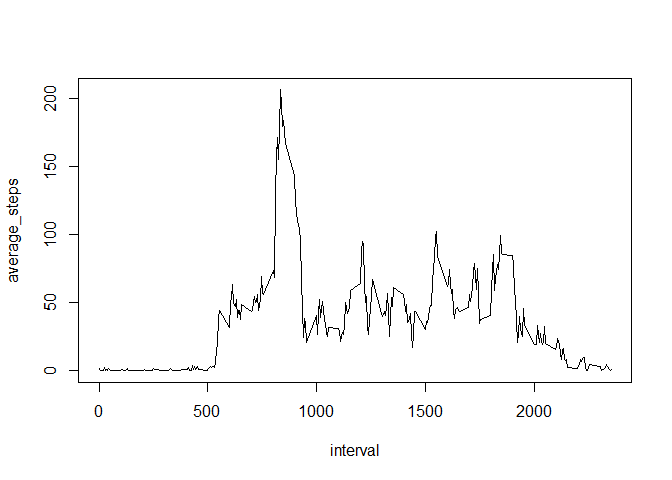
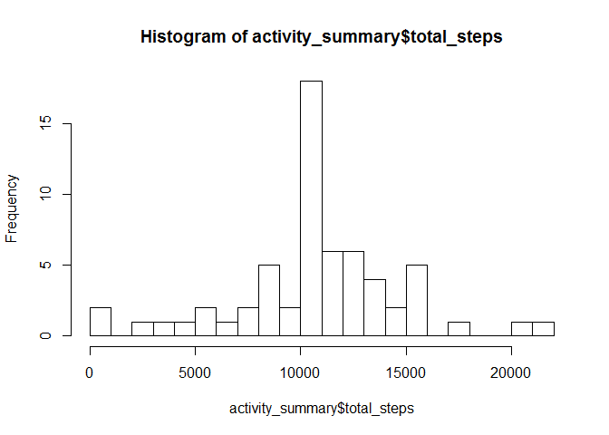
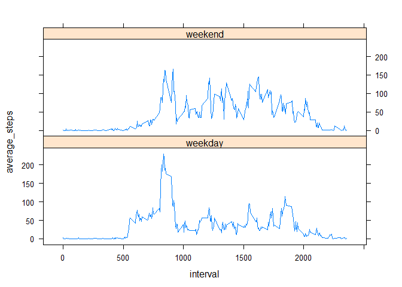

## Loading and preprocessing the data


```r
unzip("./activity.zip")
activity <- read.csv("./activity.csv")
library(dplyr)
library(lattice)
```

## What is mean total number of steps taken per day?


```r
activity_filtered <- filter(activity, !is.na(steps))
activity_grouped  <- group_by(activity_filtered, date)
activity_summary  <- summarize(activity_grouped, total_steps=sum(steps))
```


```r
hist(activity_summary$total_steps, 20)
```

<!-- -->


```r
mean(activity_summary$total_steps)
```

```
## [1] 10766.19
```

```r
median(activity_summary$total_steps)
```

```
## [1] 10765
```

## What is the average daily activity pattern?


```r
activity_filtered <- filter(activity, !is.na(steps))
activity_grouped  <- group_by(activity_filtered, interval)
activity_summary  <- summarize(activity_grouped, average_steps=mean(steps))
with(activity_summary, plot(interval, average_steps, type="l"))
```

<!-- -->


```r
activity_summary$interval[which.max(activity_summary$average_steps)]
```

```
## [1] 835
```

## Imputing missing values


```r
sum(is.na(activity$steps))
```

```
## [1] 2304
```

*Our strategy for filling in all of the missing values is to use mean for that 5-minute interval across all days.*


```r
activity_imputed <- activity
for (i in 1:nrow(activity_imputed)) {
  if(is.na(activity_imputed$steps[i])) {
    imputing <- activity_summary$average_steps[activity_summary$interval==activity_imputed$interval[i]]
    activity_imputed$steps[i] <- imputing
  }
}
```


```r
activity_grouped <- group_by(activity_imputed, date)
activity_summary <- summarize(activity_grouped, total_steps=sum(steps))
hist(activity_summary$total_steps, 20)
```

<!-- -->

```r
mean(activity_summary$total_steps)
```

```
## [1] 10766.19
```

```r
median(activity_summary$total_steps)
```

```
## [1] 10766.19
```

*Compared to the first part of the assignment, the mean is still the same but the median has changed (to be equal to the mean). The impact of imputing missing data (using mean per 5-minute interval) does not significantly distort the estimates of the total daily number of steps. However, it does distort the shape of the histogram as we can see the first part's histogram and this new histogram look significantly different, especially with regards to the height of the central spike.*

## Are there differences in activity patterns between weekdays and weekends?


```r
activity_imputed$date <- as.Date(activity_imputed$date, "%Y-%m-%d")
weekends              <- c("Saturday", "Sunday")
activity_imputed$day_type[weekdays(activity_imputed$date) %in% weekends == FALSE] <- 0
activity_imputed$day_type[weekdays(activity_imputed$date) %in% weekends == TRUE]  <- 1
activity_imputed$day_type <- factor(activity_imputed$day_type, labels=c("weekday","weekend"))
activity_grouped <- group_by(activity_imputed, day_type, interval)
activity_summary <- summarize(activity_grouped, average_steps=mean(steps))
with(activity_summary, xyplot(average_steps~interval|day_type, layout=c(1,2), type="l"))
```

<!-- -->

*It appears that activity levels are more evenly spreaded across the day during weekends, while activity levels spiked only during mornings on weekdays.*
